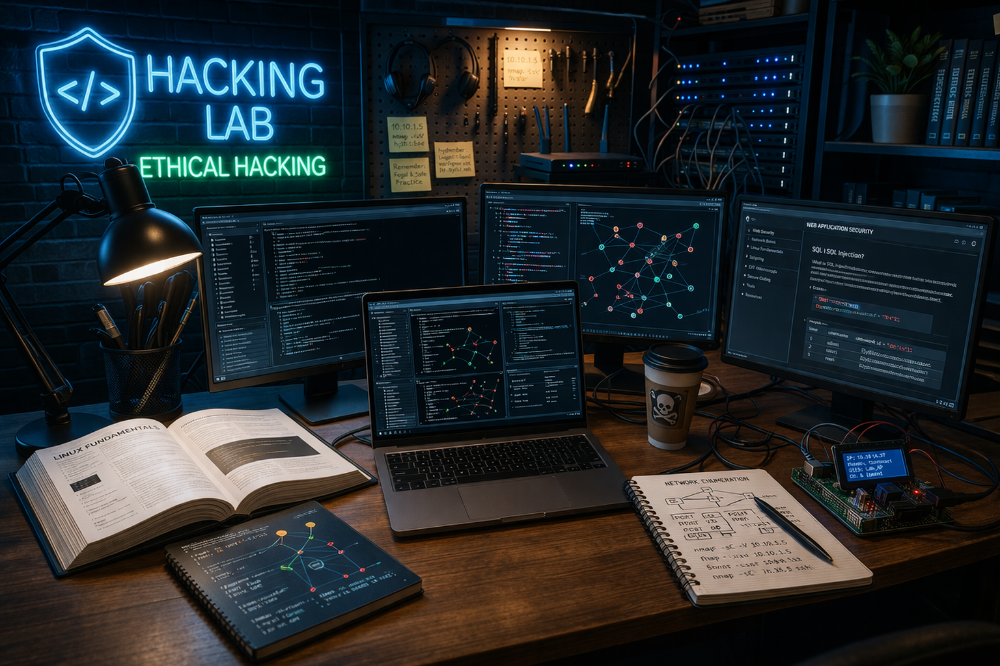

# Awesome Hacking Training  

    

 > Training your hacking skills safely and legally.  

## Contents

- [API](#api)
- [Blue Team](#blue-team)
- [Capture The Flag - CTF](#capture-the-flag---ctf)
    - [Platforms for learning](#platforms-for-learning)
    - [Platforms to organize CTF](#platforms-to-organize-ctf)
    - [Additional resources](#additional-resources)
- [Championships](#championships)
- [Cloud](#cloud)
- [Cryptography](#cryptography)
- [Forensics](#forensics)
- [Operating Systems](#operating-systems)
- [Platforms to Improve Hacking Skills](#platforms-to-improve-hacking-skills)
- [Reverse Engineering](#reverse-engineering)
- [Specific Techniques](#specific-techniques)
    - [Return-Oriented Programming (ROP)](#return-oriented-programming-rop)
- [Specific Vulnerabilities](#specific-vulnerabilities)
    - [Cross-Site Scripting - XSS](#cross-site-scripting---xss)
- [Web Applications](#web-applications)
- [Learning resources](#learning-resources)

## API
- [VAmPI](https://github.com/erev0s/VAmPI) - A vulnerable API made with Flask and it includes vulnerabilities from the OWASP top 10 vulnerabilities for APIs.

## Blue Team

- [Blue Team Labs by Cyberdefenders](https://cyberdefenders.org/blueteam-ctf-challenges/) - Put your knowledge into practice with gamified cyber security challenges.
- [LetsDefend](https://app.letsdefend.io/) - Hands-On Blue Team Training. LetsDefend helps you build a blue team career with hands-on experience by investigating real cyber attacks inside a simulated SOC.

## Capture The Flag - CTF

### Platforms for learning
- [247CTF](https://247ctf.com/) - A continuous learning environment. New challenges are added monthly, to enable you to continuously learn, hack and improve.
- [CTF365](https://ctf365.com/) - Step into our world and start hacking. Defend your servers, and launch attacks on others, all using the exact same techniques that work in the real world. 
- [CTF Challenge](https://ctfchallenge.com/) - A collection of 12 vulnerable web applications, each one has its own realistic infrastructure built over several subdomains containing vulnerabilities based on bug reports, real world experiences or vulnerabilities found in the OWASP Top 10.
- [CTF Learn](https://ctflearn.com/) - The most beginner-friendly way to learn cyber security. Test your skills by hacking your way through hundreds of challenges.
- [CTF Time](https://ctftime.org/) - It is a kind of CTF archive and of course, where you can get some other CTF-related info - current overall Capture The Flag team rating, per-team statistics, etc.
- [Google CTF](https://capturetheflag.withgoogle.com/) - Google Platform for CTF for team competitions. Instead, they consist of a set of computer security challenges involving reverse-engineering, memory corruption, cryptography, web technologies, and more. 
- [Microctfs](https://github.com/gabemarshall/microctfs) - Small CTF challenges running on Docker.
- [RingZer0 Team Online CTF](https://ringzer0ctf.com/) - RingZer0 Team's online CTF offers you tons of challenges designed to test and improve your hacking skills through hacking challenges.

### Platforms to organize CTF
- [FBCTF](https://github.com/facebookarchive/fbctf) - The Facebook CTF is a platform to host Jeopardy and “King of the Hill” style Capture the Flag competitions.
- [Mellivora](https://github.com/Nakiami/mellivora) - A CTF engine written in PHP. 

### Additional resources  
- [Awesome CTF Resources](https://github.com/devploit/awesome-ctf-resources) - A list of Capture The Flag (CTF) frameworks, libraries, resources and software for started/experienced CTF players.

## Championships

- [European Cybersecurity Challenge](https://ecsc.eu/) - The European Cyber Security Challenge is an initiative by the European Union Agency for Cybersecurity (ENISA) and aims at enhancing cybersecurity talent across Europe and connecting high potentials with industry leading organizations.
- [OAS Cyber Americas Cup](https://www.oas.org/ext/en/main/calendar/event/id/1465) - Regional initiative organized by the Cybersecurity Section of the Inter-American Committee against Terrorism (CICTE) of the Organization of American States (OAS), with the support of Hackrocks.
- [PicoCTF](https://picoctf.org/) - Provides year-round cyber security education content for learners of all skill levels. Participants learn to overcome sets of challenges from six domains of cybersecurity including general skills, cryptography, web exploitation, forensics, binary exploitation and reversing.
- [SANS Holidays Hack Challenges](https://www.holidayhackchallenge.com/) - FREE, high-quality, and super fun hands-on cybersecurity challenges designed for all skill levels. 
- [Swiss Hacking Challenge](https://www.swiss-hacking-challenge.ch/) - The Swiss Hacking Challenge (SHC), is the annual National Hacking Championship of Switzerland.

## Cloud
- [Flaws](http://flaws.cloud.s3-website-us-west-2.amazonaws.com/) - Through a series of levels you'll learn about common mistakes and gotchas when using Amazon Web Services (AWS).  

## Cryptography 

- [CryptoHack](https://cryptohack.org/) - Learn about modern cryptography by solving a series of interactive puzzles and challenges. Get to know the ciphers and protocols that secure the digital world by breaking them.
- [The Cryptopals Crypto Challenges](https://cryptopals.com/) - Cryptopals built a collection of 48 exercises derived from weaknesses in real-world systems and modern cryptographic constructions. They give you enough info to learn about the underlying crypto concepts yourself. 

## Forensics

- [Computer Forensic Reference DataSet Portal](https://cfreds.nist.gov/) - This portal is your gateway to documented digital forensic image datasets. It can assist in a variety of tasks including tool testing, developing familiarity with tool behavior for given tasks, general practitioner training and other unforeseen uses that the user of the datasets can devise. 

## Operating Systems

- [Lin.Security](https://in.security/lin-security-practise-your-linux-privilege-escalation-foo/) - A Linux VM (Ubuntu 18.04 LTS) that suffers from a number of vulnerabilities that allow a user to escalate to root on the box. This VM has been designed to help understand how certain built-in applications and services if misconfigured, may be abused by an attacker.
- [Metasploitable 2](https://docs.rapid7.com/metasploit/metasploitable-2-exploitability-guide/) - An intentionally vulnerable version of Ubuntu Linux designed for testing security tools and demonstrating common vulnerabilities.
- [Metasploitable 3](https://github.com/rapid7/metasploitable3) - VM that is built from the ground up with a large amount of security vulnerabilities. It is intended to be used as a target for testing exploits with metasploit.
- [VulnHub](https://www.vulnhub.com/) - Provides materials that allow anyone to gain practical 'hands-on' experience in digital security, computer software & network administration.
- [Vulnserver](https://thegreycorner.com/vulnserver.html) - Multithreaded Windows-based TCP server and allows the user to run a number of different commands that are vulnerable to various types of exploitable buffer overflows.

## Platforms to Improve Hacking Skills

- [Atenea](https://atenea.ccn-cert.cni.es/) - Cyber security platform that presents a number of challenges which cover a wide array of topics: Cryptography and Steganography , Exploiting, Forensics , Networking and Reversing , etc.
- [Exploit.education](https://exploit.education/) - Provides a variety of resources that can be used to learn about vulnerability analysis, exploit development, software debugging, binary analysis, and general cyber security issues.
- [Hack The Box](https://www.hackthebox.com/) -  HTB is a dynamically growing hacking community. Take your cybersecurity skills to the next level through the most captivating, gamified, hands-on training experience.
- [Hack The Site](https://www.hackthissite.org/) - A free, safe and legal training ground for hackers to test and expand their ethical hacking skills with challenges, CTFs, and more.
- [Hacker 101](https://www.hacker101.com/) - A free class for web security. Whether you are a programmer with an interest in bug bounties or a seasoned security professional, Hacker101 has something to teach you.
- [Hackviser](https://hackviser.com/) - Tailored cybersecurity upskilling platform for all levels, catering to beginners and pros. 
- [Newbie Contest](https://www.newbiecontest.org/) - A series of challenges covering several areas, from exploiting vulnerabilities and cracks, to steganography, cryptography, and programming.
- [Over The Wire](https://overthewire.org/wargames/) - The wargames can help you to learn and practice security concepts in the form of fun-filled games.
- [PentesterLab](https://pentesterlab.com/) - Platform for learning and help level up skill on Web Hacking. 
- [Pwnable.kr](http://pwnable.kr/) - Provides various pwn challenges regarding system exploitation. In order to read the flag file, you need some skills regarding programming, reverse-engineering, bug exploitation, system knowledge, cryptography.
- [Pwnable.tw](https://pwnable.tw/) - Wargame site for hackers to test and expand their binary exploiting skills.
- [Root Me](https://www.root-me.org/) - The fast, easy, and affordable way to train your hacking skills.
- [Smash The Stack](https://www.smashthestack.org/main.html#wargames) - Ethical hacking environment that simulates real-world software vulnerabilities. Each wargame allows learners to test their knowledge, skills, and abilities in reverse engineering, web app pen-testing, software exploitation, and much more.
- [Try Hack Me](https://tryhackme.com/) - Learn by following a structured paths and reinforce your skills in a real-world environment by completing guided, objective-based tasks and challenges.
- [Vulnmachines](https://www.vulnmachines.com/) - A cybersecurity learning platform where security enthusiasts can get a hands-on experience of various skills in different cybersecurity categories through Capture The Flag Contests.
- [W3Challs](https://w3challs.com/) - Security challenges to learn and practice hacking. Challenge categories: Crypto, Forensics, Misc, Pwing, Reversing and Web. 
- [WebSploit Labs](https://websploit.org/) - Includes several intentionally vulnerable applications running in Docker containers on top of Kali Linux or Parrot Security OS, several additional tools, and over 9,000 cybersecurity resources.

## Reverse Engineering

- [Crackmes](https://crackmes.one/) - This is a simple place where you can download crackmes to improve your reverse engineering skills.
- [Nightmare](https://github.com/guyinatuxedo/nightmare) - Introductory course to binary exploitation/reverse engineering based on CTF (Capture The Flag) challenges.
- [Reverse Engineering Challenges](https://challenges.re/) - Reverse engineering exercises that include different architectures and operating systems. 

## Specific Techniques

### Return-Oriented Programming (ROP)
- [ROP Emporium](https://ropemporium.com/) - Learn return-oriented programming through a series of challenges.

## Specific Vulnerabilities

### Cross-Site Scripting - XSS 
- [alert(1) to win](https://alf.nu/alert1?world=alert&level=alert0) - A place for practicing XSS, in particular filter bypassing. It requires familiarity of JavaScript and URL encoding / HTML encoding. 
- [DomGoat](https://domgo.at/cxss/intro) - DOM Security learning platform with different levels, each level targetting on different sources and sinks.
- [XSS Game](https://xss-game.appspot.com/) - In this training program, you will learn to find and exploit XSS bugs.

## Web Applications 

- [bWAPP](http://www.itsecgames.com/) - A PHP application with over 100 web vulnerabilities. It covers all major known web bugs, including all risks from the OWASP Top 10 project.
- [DVWA](https://github.com/digininja/DVWA) - A PHP/MariaDB web application that is damn vulnerable. Its main goal is to be an aid for security professionals to test their skills and tools in a legal environment, help web developers better understand the processes of securing web applications and to aid both students & teachers to learn about web application security in a controlled class room environment.
- [Hacksplaining](https://www.hacksplaining.com/) - Completely free, comprehensive security training for web developers. Learn about all the major vulnerabilities that threaten your stack and hack real vulnerable applications to see how the attacks work.
- [OWASP Mutilliadae II](https://github.com/webpwnized/mutillidae) - OWASP Mutillidae II is a free, open-source, deliberately vulnerable web application providing a target for web-security enthusiasts. 
- [OWASP Security Shepherd](https://owasp.org/www-project-security-shepherd/) - Web and mobile application security highly configurable training platform. Shepherd to be used by a single local user, by many in a competitive classroom environment, or by hundreds in an online hacking competition.
- [Samurai Web Training Framework](https://github.com/SamuraiWTF/samuraiwtf) - This project is not a vulnerable application. It is a framework designed for quickly configuring training virtual machines with tools and vulnerable application targets.
- [Vulnerable Web Application](https://github.com/OWASP/Vulnerable-Web-Application) - Website that is prepared for people who are interested in web penetration and who want to have information about this subject or to be working. It includes Command Execution, File Inclusion, File Upload, SQL and XSS. 
- [WebGoat](https://github.com/WebGoat/WebGoat) - A deliberately insecure web application maintained by OWASP designed to teach web application security lessons and demonstrate of common server-side application flaws.
- [Web Security Academy](https://portswigger.net/web-security) - Free, online web security training from the creators of Burp Suite. Learn with free interactive labs and progress-tracking.
- [Web Security Dojo](https://www.mavensecurity.com/resources/web-security-dojo) - A free open-source self-contained training environment for Web Application Security penetration testing.
- [Wishtackt's Websheep](https://github.com/wishtack/wishtack-websheep) - Websheep is a willingly vulnerable set of frontend JavaScript applications and ReSTful APIs.
- [XVWA](https://github.com/s4n7h0/xvwa) - A badly coded web application written in PHP/MySQL that helps security enthusiasts to learn application security.

## Learning resources

- [Metasploit Unleashed](https://www.offensive-security.com/metasploit-unleashed/) - It is the most complete and in-depth Metasploit guide available by Offensive Security, with contributions from the authors of the No Starch Press Metasploit Book. 
- [Zenk Security](https://www.zenk-security.com/) - Tutorials, informative articles, and other technical and non-technical texts on various areas of cybersecurity.

## Contributing

Your contributions and suggestions are heartily welcome. Please check the [Contributing Guidelines](contributing.md) for more details.
